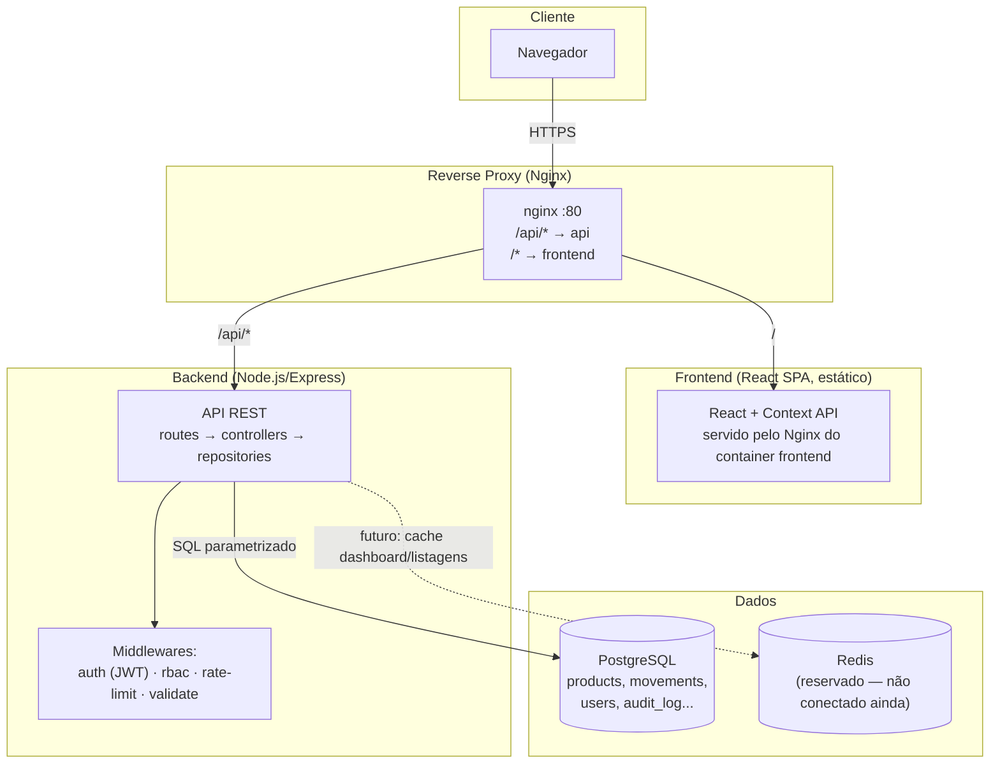
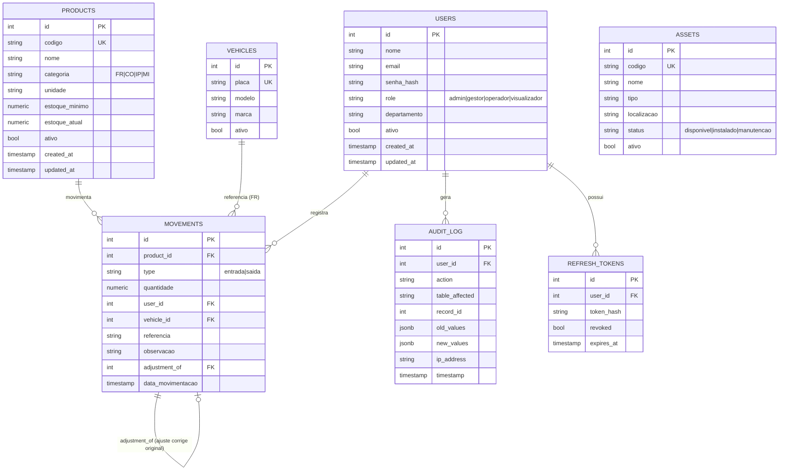
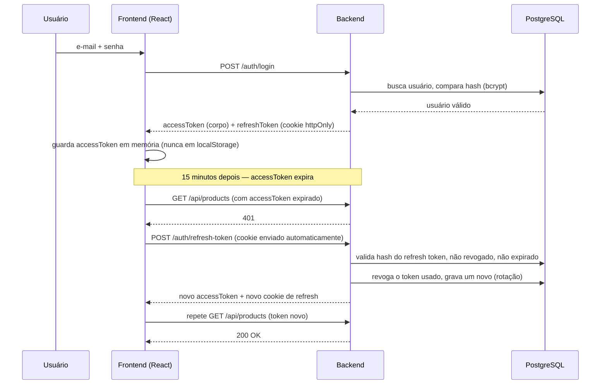
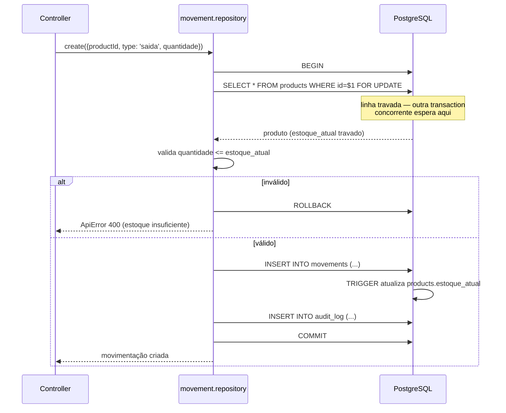

# Arquitetura — ALMOX//CTRL

## Visão geral de componentes

## Modelo de dados (ER)

## Fluxo de autenticação (sequência)

## Fluxo de uma movimentação (transaction + lock)

## Por que estas escolhas (resumo — detalhes nos READMEs de cada pasta)

| Decisão | Alternativa considerada | Motivo da escolha |
|---|---|---|
| SQL direto (`pg`) em vez de ORM | Prisma/Sequelize | Volume pequeno de dados, auditabilidade de query, menos dependência |
| Context API em vez de Redux | Redux Toolkit | App de ~12 telas sem estado cross-página complexo |
| Access token em memória, refresh em cookie httpOnly | Ambos em localStorage | Reduz superfície de roubo via XSS |
| Nginx único como reverse proxy | Frontend e API em domínios/portas separados | Mesma origem em produção → sem CORS, cookie `SameSite=strict` funciona sem exceções |
| Movimentação nunca editada/excluída | UPDATE/DELETE direto | Rastreabilidade total do estoque — auditoria exige saber o que aconteceu, não só o estado final |
